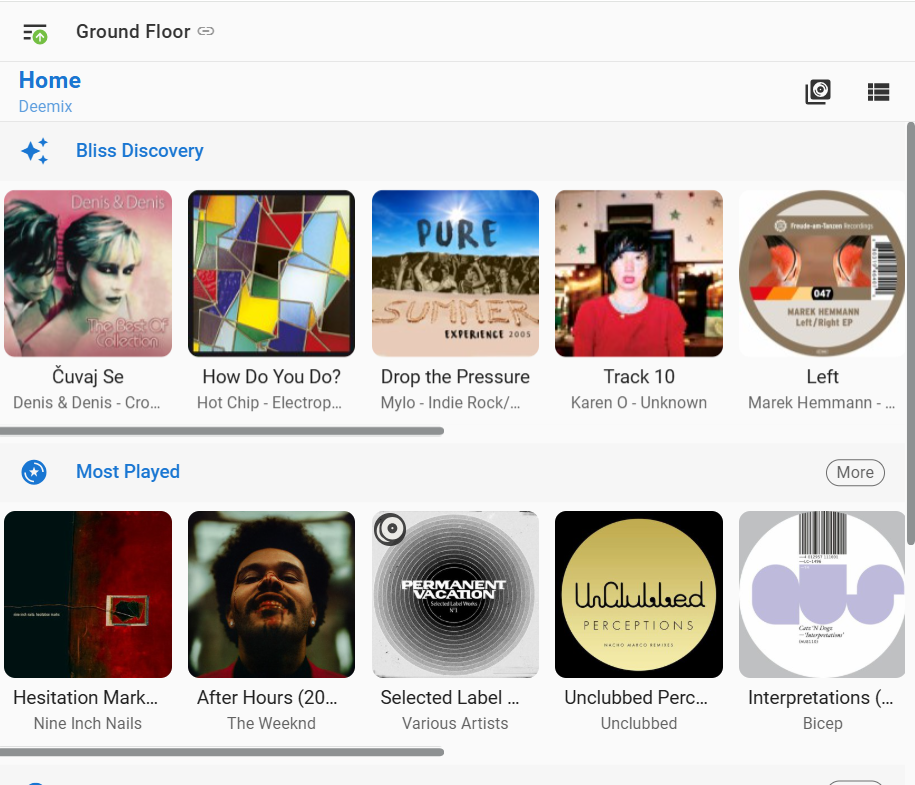
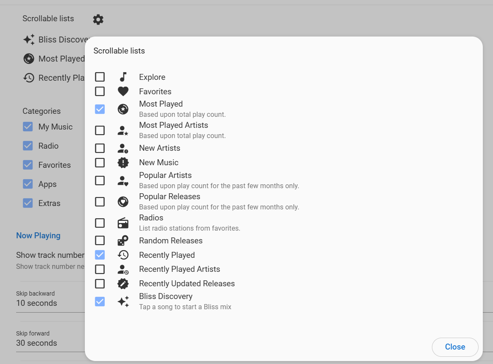
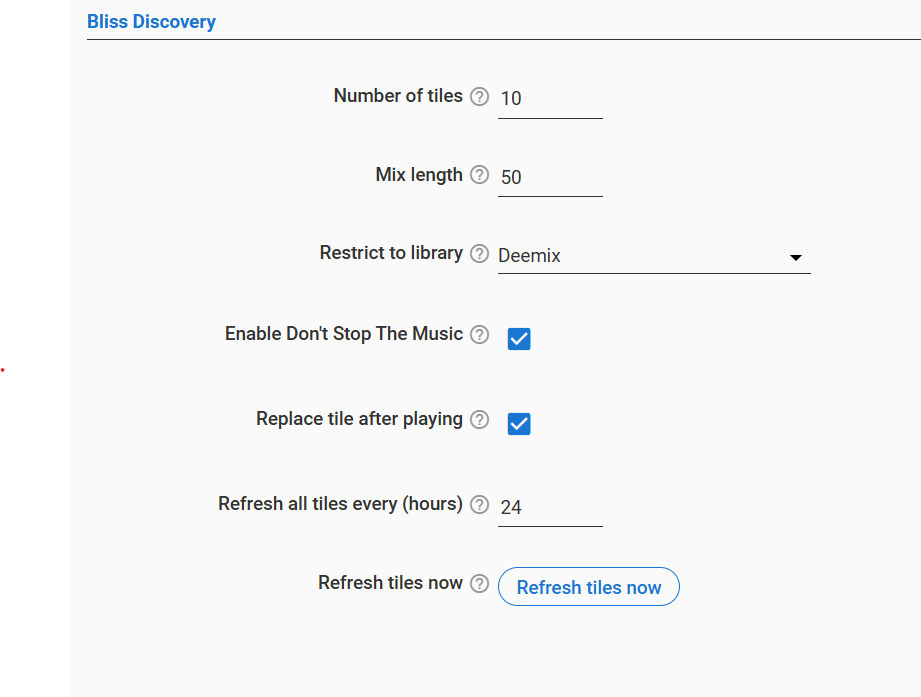

# Bliss Discovery (LMS / Lyrion plugin)

Adds a **Bliss Discovery** section to the Material Skin home screen — a row of
album-art tiles, each a randomly picked song from a **different genre**, shown
exactly like Material's "New Music" section. Tapping a tile immediately
starts a **Bliss mix** seeded from that song on the current player.

Requires:
* **Material Skin** (recent version with third-party home-screen sections)
* **Bliss Mixer** plugin, with your library analysed by bliss-analyser

## Screenshots

| Home screen section | Enabling in Material Skin | Plugin settings |
|---|---|---|
|  |  |  |

## Install

### Via the LMS plugin repository (recommended)

1. In LMS, open **Settings → Plugins**, scroll to the bottom and add this URL
   under **Additional Repositories**:

   ```
   https://raw.githubusercontent.com/cucko/BlissDiscovery/main/public.xml
   ```

2. Press **Apply**. **Bliss Discovery** now shows up in the plugin list under
   3rd party plugins — check it, press **Apply** again, and restart LMS when
   prompted.
3. Future updates show up the same way LMS's own plugins do: a new version in
   the list to check and apply.

### Manual install

1. Stop LMS.
2. Copy the `BlissDiscovery` folder into your LMS `Plugins` directory so you get
   `Plugins/BlissDiscovery/Plugin.pm`.
3. Start LMS. The plugin is enabled by default.

### After installing

In Material Skin open **Settings → Interface → Home screen** (the list of
home-screen sections such as New Music / Recently Played) and enable
**Bliss Discovery**. Drag it to where you want it.

## Settings

Server Settings → Plugins → Bliss Discovery:

| Setting | Default | Meaning |
|---|---|---|
| Number of tiles | 6 | 1–12 tiles, one genre each |
| Mix length | 20 | Tracks in the generated mix (1–50) |
| Restrict to library | All music | Pick tiles and mix tracks only from a virtual library. Choose a specific library, or **Player's library view** to follow each player's own library setting (LMS Settings → Player → Library View); in that mode every player gets its own tile set |
| Enable Don't Stop The Music | off | Also switch the player's DSTM to Bliss Mixer when a tile is tapped |
| Replace tile after playing | on | The tapped tile is swapped for a song from a genre not currently shown |
| Refresh all tiles every (hours) | 24 | Periodic re-pick of all tiles; 0 disables. Tiles also refresh after every rescan |
| Refresh tiles now | — | Button to re-pick immediately |

Tile changes are pushed to Material live (no page reload needed).

## How it works

* On startup (and after rescans / on schedule) the plugin picks random genres
  and one random local track per genre.
* It registers a home-screen section with Material via
  `Plugins::MaterialSkin::Plugin->registerHomeExtra`. Material asks for the
  items when it draws the home screen; each item carries the track's cover
  (`music/<coverid>/cover.jpg`) and a `go` action `blissdiscovery playlist play tile:N`.
* The section shows "Number of tiles" tiles. Pressing Material's **More**
  button on the section header opens a page with **3×** that many tiles — the
  extra ones are picked on demand (again one per genre, genres/songs already
  shown are skipped) and appended, so the tiles already on the home row keep
  their place.
* Tapping runs that command on the current player. The plugin calls
  `blissmixer mix track_id:<id> count:<n>` (the Bliss Mixer plugin does all
  the mixing), loads the returned tracks with the seed song first, optionally
  switches DSTM to Bliss, and shows a Material toast.

## CLI

```
blissdiscovery playlist play tile:<n>   # start a Bliss mix from tile n (needs player)
blissdiscovery refresh                  # re-pick all tiles
blissdiscovery list                     # show current tiles
```

## Library restriction

Bliss Mixer itself doesn't know about virtual libraries, and Material only
passes its browser-selected library to its own built-in sections. So the
plugin handles it: tile songs are picked from the chosen library, Bliss is
asked for up to 3× the mix length, and the result is filtered to tracks in the
library before loading (trimmed back to the mix length). If very few tracks in
a library have been analysed, mixes may come out shorter than requested.

## Notes

* Songs are picked from the LMS library, not from the Bliss analysis DB. If a
  picked song was never analysed, Bliss returns no tracks and you'll see an
  error toast — just tap another tile or refresh.
* Only local (`file://`) tracks are used; cue-sheet sub-tracks are skipped.
* If the Material Skin plugin isn't installed you'll get a warning in the
  server log and no tiles.
